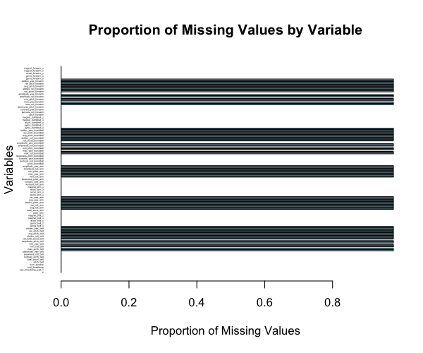
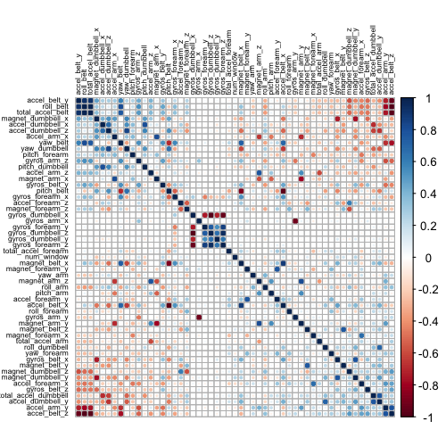

```{r loadingpackages, echo=FALSE, message = FALSE}
# Load the needed package
library(dplyr)
library(knitr)
library(ggplot2)
library(lubridate)
library(utils)
library(tidyr)
library(lattice)
library(caret)
library(corrplot)
library(rpart)
library(rattle)
library(randomForest)
```

## Introduction
In the following work, measurements about personal activity were recorded using accelerometers fixed on the belt, forearm, arm, and dumbell of 6 participants. They were asked to perform barbell lifts correctly and incorrectly in 5 different ways. The goal is to train machine learning models which are capable to distinguish the manner in which the exercices were performed using the recorded data.

Both the training and the final testing data are downloaded below and come from the following source: http://groupware.les.inf.puc-rio.br/har [1]

The csv files are then saved into dataframe tables.

```{r loadingdata, echo=TRUE}
# Load the data from the url if the data folder does not already exist in the correct folder
train_data_name <- "pml-training.csv"
test_data_name <- "pml-testing.csv"

if (!file.exists(train_data_name)) {
      training_data_url <- "https://d396qusza40orc.cloudfront.net/predmachlearn/pml-training.csv"
      download.file(training_data_url, train_data_name, method="curl")
}

if (!file.exists(test_data_name)) {
      test_data_url <- "https://d396qusza40orc.cloudfront.net/predmachlearn/pml-testing.csv"
      download.file(test_data_url, test_data_name, method="curl")
}

raw_train_table <- read.table("pml-training.csv", sep=",", header=TRUE)
raw_test_table <- read.table("pml-testing.csv", sep=",", header=TRUE)
```

## Processing the raw data

Before modelling, the raw data needs to be processed to be usable. We start by checking the dimensions of the training data table. It has 19622 samples and 160 variables. The final test table has 20 samples and the same 160 variables as the training table. 

Looking at the first values of the training table (with the command `str()`, here put under comment), we notice that we have a lot of numerical variables, which are the measurements of the different accelerometers. The `classe` column is the target variable `y` which we want to predict (i.e. the manner in which the exercice was performed). We also have some identification variables (`X`, `user_name`, timestamp variables) which are not needed for the classification task. 

Some columns seem to have a high number of `NAs` or of empty strings. One way to visualize this is to plot the proportion of missing values with a barplot. Thus can be seen below, where missing values are represented by the dark bars.
```{r EDA1, echo=TRUE, message=FALSE, warning=FALSE}

# Exploratory Data Analysis
cat("The dimension of the raw train table is:", dim(raw_train_table), "\nThe dimension of the test data is:", dim(raw_test_table), "\nThe total number of missing values in the raw train table is:", sum(is.na(raw_train_table)))

missing_proportions <- sapply(raw_train_table, function(x) mean(is.na(x)))

png("missing_values_plot.png", width = 600, height = 500, res = 100)
barplot(missing_proportions, main="Proportion of Missing Values by Variable",
        xlab="Proportion of Missing Values", ylab="Variables",
        las=1, col="lightblue", cex.names=0.2, horiz=TRUE)
invisible(dev.off())

```



With the barplot, it is possible to see that the variables which do have missing values also have a very high proportion of missing values (almost 100%). Those variables have therefore almost no valuable information for modelling, and will be discarded. A threshold of 95% missing values is chosen to decide which columns to keep. 

```{r EDA2, echo=TRUE}
# Checking for NAs
cleaned_train_table <- raw_train_table[, (missing_proportions > 0.95) == FALSE]

cat("The dimension of the cleaned train table is:", dim(cleaned_train_table), "\nThe total number of missing values in the cleaned train table is:", sum(is.na(cleaned_train_table)))

string_variables <- sapply(cleaned_train_table, is.character)

```

After getting rid of the columns with a high proportion of `NAs`, the number of columns has decreased from 160 to 93, and the total number of `NAs` is now 0. As a second step, a similar operation is performed with empty strings, with all columns that have more than 95% empty strings are discarded. 

```{r EDA3, echo=TRUE}
# Checking for Empty strings
empty_string_proportions <- sapply(cleaned_train_table, function(x) {
      if (is.character(x)) {
            mean(x == "")
      } else {
            0  # For non-character columns, set proportion of empty strings to 0
      }
})

cleaned_train_table_2 <- cleaned_train_table[, empty_string_proportions <= 0.95]
cat("The dimension of the cleaned train table is:", dim(cleaned_train_table_2))
```
At this point, only 60 columns are kept. We can still get rid of the near zero variance variables, and the variables that are only present for identification purpose, and are therefore not relevant for predictions.  

```{r EDA4, echo=TRUE}
# Checking for NearZeroVariance variables
nzv_variables <- nearZeroVar(cleaned_train_table_2)
cleaned_train_table_3 <- cleaned_train_table_2[ , -nzv_variables]
cat("The dimension of the cleaned train table is:", dim(cleaned_train_table_3))
```

```{r EDA5, echo=TRUE}
# Remove identification columns and timestamps, not relevant for the predictions
cleaned_train_table_4 <- cleaned_train_table_3[ , -(1:5)]
cat("The dimension of the final cleaned train table is:", dim(cleaned_train_table_4), "\nThe number of string variables in the cleaned data:", sum(sapply(cleaned_train_table_4, is.character)), "\nThe number of float variables in the cleaned data:", sum(sapply(cleaned_train_table_4, is.numeric)), "\nThe number of integer variables in the cleaned data:", sum(sapply(cleaned_train_table_4, is.integer)))


```

After cleaning the dataframe, it has a total of 54 variables, with:

- 1 string variable (the target variable `classe`)
- 53 numerical variables, from which 26 are integers. 

To be consistent between the training and testing datasets, the same actions are performed on the testing data.

```{r EDA6, echo=TRUE}
# Do the same for the test set
cleaned_test <- raw_test_table[, (missing_proportions > 0.95) == FALSE]
cleaned_test <- cleaned_test[, empty_string_proportions <= 0.95]
cleaned_test <- cleaned_test[ , -nzv_variables]
cleaned_test <- cleaned_test[ , -(1:5)]
```

Now that the data is cleaned, an 80/20 split is done on the the training data to separate it into 2 different sets: the actual training part that will be used to fit the different models (called `training_dataset`), and a testing set that will be used to attest the performance of the best models (called `testing_dataset`). 

As for the final 20 samples test set that was downloaded separately, it will only be used at the very end.

```{r splitting, echo=TRUE}
# Split cleaned_train_table_4 into a Training data set and a Validation data set
set.seed(51)
training <- createDataPartition( y = cleaned_train_table_4$classe,
                                   p = 0.80,
                                   list = FALSE)
cleaned_train_table_4$classe <- as.factor(cleaned_train_table_4$classe)
training_dataset <- cleaned_train_table_4[training,]
testing_dataset <- cleaned_train_table_4[-training,]
```

The data is now ready for analysis as well as for modelling. A quick correlation matrix of the training data is plotted below, which allows to identify important linear relationships between different variables. This is the case for variables that have a dark red circle (negative linear relationship) or a dark blue circle (positive linear relationship). On the other hand, white circles indicate no or only a very low linear relationship.

```{r correlation, echo=TRUE}

# EDA (Correlation Matrix)
corr_matrix <- cor(training_dataset[ , -54]) # Remove the target variable which is a string

png("corr_plot.png", width = 500, height = 500, res = 100)
corrplot(corr_matrix, order = "FPC", method = "circle", type = "full",
         tl.cex = 0.5, tl.col = rgb(0, 0, 0))
invisible(dev.off())
```



## Modelling

The first model that will be trained in this part is a decision tree model. A cross-validation with 5 folds is performed with a grid-search on the `cp` parameter. The best fitted model is then saved in `model_decisiontree`, and predictions are evaluated on the `testing_dataset`. The accuracy achieved with this model is equal to 95.56%.

```{r dt, echo=TRUE}
tunegrid_dt <- expand.grid(cp = seq(0.000001, 0.0001, by = 0.000001))
control_decisiontree <- trainControl(method = "cv", number = 5)
fit_decisiontree <- train(classe ~ ., data = training_dataset, method = "rpart",
                     trControl = control_decisiontree, tuneGrid = tunegrid_dt)
print(paste("Best cp parameter for the fitted decision tree:", fit_decisiontree$bestTune$cp))

model_decisiontree <- rpart(classe ~ ., data = training_dataset, 
                        control = rpart.control(cp = fit_decisiontree$bestTune$cp))

test_predictions_dt2 <- predict(model_decisiontree, testing_dataset, type = "class")

confusionmatrix_decisiontree2 <- confusionMatrix(test_predictions_dt2, testing_dataset$classe)
print(confusionmatrix_decisiontree2)
```

The next type of model that will be trained is a Random Forest. Random Forests are composed of several Decision Trees aligned in parallel. Here, the number of cross-validation is only 3. I chose a lower cross-validation number because of the increased time needed to train a Random Forest compared to a Decision Tree alone. As for the grid-search, it is performed over the `mtry` parameter. The best fitted model is saved in a `rds` file to avoid having to train the model again. Predictions are again performed on the test set, for which we get an accuracy of 99.85%.

```{r rf_train, echo=TRUE, eval=FALSE}
## Random Forests
control_randomforest <- trainControl(method = "cv", number = 3)
num_predictors <- ncol(training_dataset) - 1
mtry_values <- seq(3, num_predictors, by = 10)
tunegrid_rf <- expand.grid(mtry = mtry_values)

fit_randomforest <- train(classe ~ ., data = training_dataset, method = "rf",
                         trControl = control_randomforest, tuneGrid = tunegrid_rf,
                         verbose = FALSE)

saveRDS(fit_randomforest, file = "fit_randomforest.rds")
```


```{r rf, echo=TRUE}
## Random Forests
fit_randomforest <- readRDS("fit_randomforest.rds")

print(paste("Best mtry parameter for the fitted random forest:", fit_randomforest$bestTune))

test_predictions_rf <- predict(fit_randomforest, testing_dataset)

confusionmatrix_rf <- confusionMatrix(test_predictions_rf, testing_dataset$classe)
print(confusionmatrix_rf)
```

Finally, the last model that will be trained is a Gradient Boosting Model (GBM). It also uses Decision Trees as a base. But contrary to a Random Forests where Decision Trees are aligned in a parallel manner, a GBM uses several Decision Trees in a sequence. 

In this case, a fourfold cross-validation is performed, with a grid-search on the number of trees `n.trees`. Similarly to the Random Forest, the best fitted model is saved in the `fit_gbm.rds` file. After doing predictions on the testing dataset, an accuracy of 98.19% is obtained.

```{r gbm_train, echo=TRUE, eval=FALSE}
# GBM
control_gbm <- trainControl(method = "cv", number = 4)

ntrees_values <- seq(200, 900, by = 50)
tunegrid_gbm <- expand.grid(
      n.trees = ntrees_values,
      interaction.depth = 1, 
      shrinkage = 0.1,      
      n.minobsinnode = 10   
)

fit_gbm <- train( classe ~.,
                  data = training_dataset,
                  method = "gbm",
                  trControl = control_gbm,
                  tuneGrid = tunegrid_gbm,
                  verbose = FALSE)

saveRDS(fit_gbm, file = "fit_gbm.rds")
```

```{r gbm, echo=TRUE}
fit_gbm <- readRDS("fit_gbm.rds")
print(paste("Best ntrees parameter for the fitted GBM:", fit_gbm$bestTune$n.trees))
test_predictions_gbm <- predict(fit_gbm, testing_dataset)

confusionmatrix_gbm <- confusionMatrix(test_predictions_gbm, testing_dataset$classe)
print(confusionmatrix_gbm)
```

Comparing the accuracy of the three models between each other, the Random Forest is the one that performs the best, with an accuracy of 99.85%. It is followed closely by the GBM (98.19%) and then by the single Decision Tree (95.56%). 

## Final predictions

The final predictions of the testing dataset of small samples are done with the best model found previously, which is the Random Forest. They are calculated below, with the predicted class for each sample. 

```{r final predictions, echo=TRUE}
realtest_predictions_rf <- predict(fit_randomforest, cleaned_test)

print(realtest_predictions_rf)
```

[1] Velloso, E.; Bulling, A.; Gellersen, H.; Ugulino, W.; Fuks, H. “Qualitative Activity Recognition of Weight Lifting Exercises. Proceedings of 4th International Conference in Cooperation with SIGCHI (Augmented Human ’13)”. Stuttgart, Germany: ACM SIGCHI, 2013.


